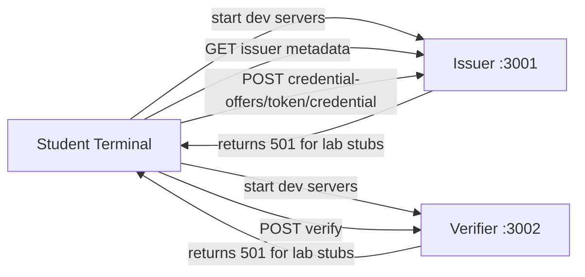

# Lab 00 — Start (Scaffolding + Health Checks)

Lab ID: `00` · Timebox: 10 minutes

Goal: get the scaffold running, env files in place, and verify the expected 501 stubs before coding.

## What This Lab Is Doing

This lab is not about implementing a feature yet. It is about orienting students to the system boundary:

- `issuer/` will eventually mint credentials
- `verifier/` will eventually validate presentations
- `bbs-lib/` holds the selective-disclosure cryptography used later

The important teaching point is that the repo already has the shape of the final system, but the main feature endpoints are still stubs. Students should see the system boot, inspect the metadata, and prove to themselves that later labs really do add behavior step by step.

## Flow Overview

## What Students Should Understand

- there are two main services, not one
- issuer metadata can exist before issuance is implemented
- the lab starts from a deliberately incomplete scaffold
- later labs will replace the `501 Not Implemented` responses with real VC flows

Environment tracks
- Codespaces
  - Stay on `main` in your Codespace.
  - The dev container usually already ran `pnpm env:setup` and `pnpm install -r --frozen-lockfile` for you.
- Local terminal
  - Stay on `main` in your local clone.
  - Install prerequisites with the root `README.md` bootstrap steps.
  - Run `pnpm env:setup`.
  - Run `pnpm install -r --frozen-lockfile`.

Steps
1) Install deps: `pnpm install -r`.
2) Start services: `pnpm dev` (Issuer on :3001, Verifier on :3002).
   - Leave this running in its own terminal.
3) Open a second terminal for checks and hit metadata: `curl http://localhost:3001/.well-known/openid-credential-issuer` (should return issuer metadata if present; credential endpoints will be stubs).
4) Confirm stubs return 501:  
   - `curl -i -X POST http://localhost:3001/credential-offers -d '{}' -H 'content-type: application/json'`  
   - `curl -i -X POST http://localhost:3001/token -d '{}' -H 'content-type: application/json'`  
   - `curl -i -X POST http://localhost:3001/credential -d '{}' -H 'content-type: application/json'`  
   - `curl -i -X POST http://localhost:3002/verify -d '{}' -H 'content-type: application/json'`
5) Open the annotated code for reference during the lab: `issuer/src/index.ts`, `verifier/src/index.ts`, `bbs-lib/src/index.ts` (comments describe the intended flow).

Pass criteria
- Servers boot without errors.
- Credential/verify endpoints still return 501 (to be implemented in later labs).

Troubleshooting
- Port in use: edit `ISSUER_PORT` / `VERIFIER_PORT` in `.env` files to avoid conflicts.
- Node/pnpm missing: see repo `README.md` for bootstrap scripts (macOS + Windows + Codespaces).
- If the metadata endpoint 404s, ensure the dev servers are running on `main`.
