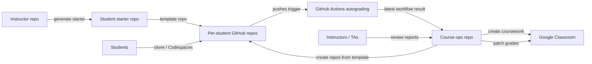

# Architecture

## Logical architecture

## Deployment model

### Instructor repo
- private or org-internal
- holds final reference implementation
- generates the student template

### Student starter repo
- org-owned or public
- marked as template
- used only for repo generation

### Per-student repos
- private
- one repo per student per assignment or per course, depending on your chosen progression model
- GitHub Actions enabled

### Course-ops repo
- private
- secrets stored here
- all release and grading commands executed here
- artifacts committed or uploaded from here

## Recommended data flow

### Repo provisioning
1. load roster CSV
2. load assignment YAML
3. compute target repo names
4. create repos from the template
5. add student collaborators
6. set `LAB_ID`
7. write repo map artifact

### Coursework publishing
1. load course config
2. load assignment YAML
3. render description
4. call Google Classroom `courses.courseWork.create`
5. save returned `courseWorkId`

### Grade sync
1. load repo map
2. get latest workflow run per repo
3. map workflow state to score
4. map student email to Google user ID
5. find student submission
6. patch `draftGrade` and optionally `assignedGrade`
7. save report

## Control-plane files

### Human-authored
- `catalog/course.config.yaml`
- `catalog/assignments/*.yaml`
- `catalog/roster.csv`

### Machine-generated
- `artifacts/plan.*.md`
- `artifacts/repo-map.*.json`
- `artifacts/progress.*.json`
- `artifacts/advance.*.json`
- `artifacts/reconcile.*.json`
- `artifacts/coursework.*.json`
- `artifacts/grade-sync.*.json`

## Idempotency rules

Good operations scripts should be safe to rerun.

### Provisioning
- if repo exists, reuse it
- if collaborator exists, leave it alone
- if variable exists, update it
- if topics exist, replace only if configured

### Coursework publishing
- create once, then persist returned `courseWorkId`
- later updates should use patch, not create

### Grade sync
- patch only when the computed grade changes
- keep a full report even when no updates were needed

## Security boundaries

### GitHub side
The automation token should be able to:
- create repos from the template
- manage variables
- add collaborators
- read workflow runs

It should not be a broad personal token if you can avoid that long-term.

### Google side
The Classroom OAuth client and refresh token become part of your grading control plane. Treat them like production credentials.

## World-class operational features to add later

- push notifications instead of polling
- instructor dashboard
- exception queue for unmatched students
- automatic “dry-run diff” preview before release
- audit log export
